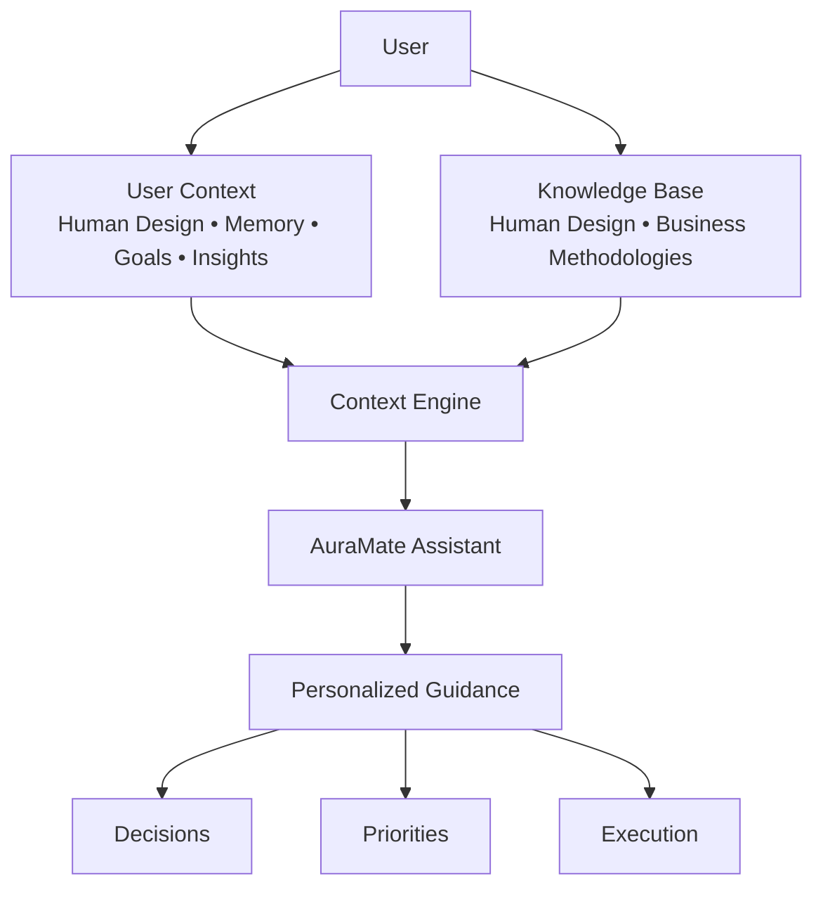

# Sacral Business OS

AI-native decision support and implementation platform that combines personalized memory, knowledge retrieval, and contextual guidance to help users apply Human Design and business methodologies in real-world situations.

## Overview

I built Sacral Business OS to explore how AI can move beyond simple chat interactions and become a personalized workspace that helps users make decisions, organize information, and implement ideas. The platform combines persistent user memory, retrieval-augmented knowledge systems, and AI-powered guidance to deliver contextual recommendations based on each user's Human Design chart, goals, experiences, and evolving needs.

## System Architecture

The platform combines persistent user context, retrieval-based knowledge systems, and AI-powered guidance to help users make decisions, prioritize actions, and implement ideas over time.

## Key Features

- Personalized user memory
- Knowledge retrieval (RAG-style architecture)
- AI-powered guidance and decision support
- Multi-model support (OpenAI + Gemini)
- Streaming chat experience
- User onboarding and profile system
- Saved insights and long-term context

## My Role

I designed and built the platform end-to-end, including:

- Product strategy
- UX and workflow design
- Prompt architecture
- AI orchestration
- Knowledge retrieval systems
- Memory systems
- Frontend implementation
- Database design
- User onboarding

## Technology Stack

- Next.js
- TypeScript
- Supabase
- Clerk
- OpenAI
- Gemini
- Vercel

## Case Study

https://www.sacralos.ai/case-study

## Personalized Memory

The platform maintains a structured user profile that combines Human Design data, onboarding responses, user-provided context, preferences, goals, and insights generated through prior interactions. Rather than treating each conversation as a blank slate, the system selectively retrieves relevant information to create continuity across sessions and enable increasingly personalized guidance over time.

## Knowledge Retrieval

Sacral Business OS uses a retrieval-based knowledge system containing Human Design education, business frameworks, implementation guidance, deconditioning concepts, and proprietary methodologies. Relevant content is dynamically selected based on the user's question, profile, and current context, allowing responses to be grounded in a curated knowledge base rather than relying solely on model training data.

## Context Assembly

Before generating a response, the system assembles multiple sources of context into a single prompt. This may include user memory, Human Design chart information, retrieved knowledge documents, tool-specific instructions, conversation history, and current user goals. This orchestration layer allows the AI to deliver recommendations that are both personalized and contextually relevant while minimizing unnecessary token usage.

## AI Response Generation

The assembled context is provided to the language model along with tool-specific behavioral instructions. Different AI tools within the platform can use different prompts, knowledge sources, and workflows while sharing the same personalization layer. Responses are generated in real time and designed to support decision-making, implementation, reflection, and ongoing behavior change rather than providing generic advice.

## Lessons Learned

### What Worked

- Persistent memory significantly improved perceived personalization and reduced repetitive onboarding conversations.
- Grounding responses in curated knowledge produced more consistent outputs than relying solely on model reasoning.
- Users responded positively when AI guidance felt contextual and implementation-focused rather than purely informational.
- Human Design provided a useful personalization framework that allowed guidance to feel highly individualized while remaining structured.

### What Didn't

- Early versions relied too heavily on large prompts, resulting in increased token usage and slower response times.
- Generic memory retrieval occasionally surfaced information that was technically relevant but not useful to the current conversation.
- Large knowledge bases require thoughtful organization and retrieval strategies to avoid overwhelming the model with unnecessary context.
- Prompt-only approaches became difficult to maintain as the product expanded into multiple tools and workflows.

### How I Measure Adoption

- User engagement with individual tools and workflows.
- Repeat usage across multiple sessions.
- Growth in saved memories, insights, and user-generated context.
- Qualitative feedback regarding relevance, usefulness, and personalization.
- Ongoing observation of which features users returned to most frequently.

### Tradeoffs I Made

- Chose retrieval-based knowledge over loading entire knowledge bases into prompts to reduce token consumption and improve scalability.
- Prioritized personalization and contextual relevance over complete transparency of internal AI workflows.
- Accepted increased system complexity in exchange for more adaptive and user-specific guidance.
- Focused on implementation support and decision-making rather than building a general-purpose AI assistant.
- Prioritized response quality over feature expansion. I focused on making the AI feel genuinely personalized and context-aware (uncanny!) before investing in additional workspace features, believing that trust and relevance were more important to adoption than feature count.
